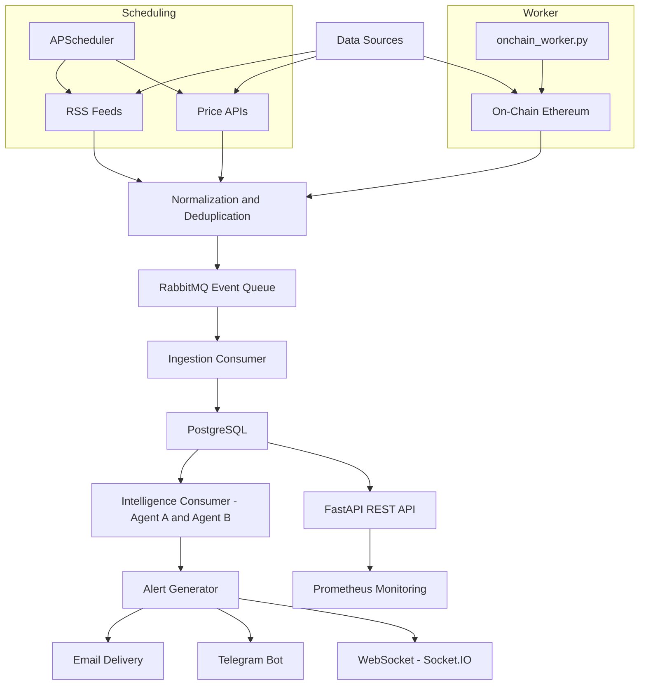

<p align="center">
  <h1 align="center">AETERNA — Autonomous Alpha Engine</h1>
  <p align="center">
    <em>AI-powered cryptocurrency intelligence, alerting, and analysis platform with real-time multi-channel delivery.</em>
  </p>
  <p align="center">
    
    
    
    
    
    
  </p>
</p>

---

## Table of Contents

- [Overview](#overview)
- [Key Features](#key-features)
- [Architecture](#architecture)
- [Quick Start](#quick-start)
- [Configuration](#configuration)
- [Development](#development)
- [Intelligence Agents](#intelligence-agents)
- [Trade Records](#trade-records)
- [On-Chain Collector](#on-chain-collector)
- [Utility Scripts](#utility-scripts)
- [Deployment](#deployment)
- [Contributing](#contributing)
- [License](#license)

---

## Overview

AETERNA is a modular, production-ready data ingestion, intelligence, and event processing engine purpose-built for cryptocurrency markets. It collects data from RSS feeds, price APIs, and on-chain Ethereum sources; scores and filters events using a multi-agent AI pipeline; and delivers real-time alerts via email, Telegram, and WebSocket.

---

## Key Features

| Category           | Capabilities                                                                                                                                                                             |
| ------------------ | ---------------------------------------------------------------------------------------------------------------------------------------------------------------------------------------- |
| **Data Ingestion** | RSS feeds, price APIs, on-chain Ethereum monitoring (WebSocket), ERC20 transfer collection, Uniswap V2/V3 DEX swap detection                                                            |
| **Intelligence**   | Agent A — event scoring with noise reduction and bot/spam detection; Agent B — wallet profiling, entity identification, behavioral clustering, win-rate analysis, and priority boosting |
| **Trade Analytics**| Deterministic trade-record persistence, FIFO profitability resolution, DEX swap extraction, backfill utilities, and backlog reporting                                                   |
| **Alerting**       | Real-time alert generation, consumer pipelines, user preference-aware delivery                                                                                                          |
| **Delivery**       | Email (HTML templates, Resend API), Telegram bot, WebSocket (Socket.IO) push                                                                                                             |
| **Identity & Auth**| JWT authentication, user registration/login, user preferences, email preferences                                                                                                        |
| **Admin**          | Dashboard with system metrics, user management, role-based access control (RBAC), admin bootstrap                                                                                       |
| **Security**       | Rate limiting middleware, input sanitization, password hashing, admin-only endpoints                                                                                                     |
| **Monitoring**     | Prometheus metrics, structured logging, `/health/system` diagnostics endpoint                                                                                                            |
| **Infrastructure** | PostgreSQL, Redis (deduplication + cache), RabbitMQ (event broker), Celery, APScheduler                                                                                                 |

---

## Architecture

AETERNA follows a **Domain-Driven Design (DDD)** modular structure. Each module is organized into four layers:

```
app/modules/<module>/
├── application/    # Business logic, services, consumers, collectors
├── domain/         # Domain models, entities, value objects
├── infrastructure/ # Database models, external integrations
└── presentation/   # API routes, schemas, endpoints
```

### Modules

| Module           | Purpose                                                                                                       | Key Files                                                                            |
| ---------------- | ------------------------------------------------------------------------------------------------------------- | ------------------------------------------------------------------------------------ |
| **Ingestion**    | Collects events from external sources and publishes to RabbitMQ, including on-chain transfers and DEX swaps   | `rss_collector.py`, `price_collector.py`, `onchain_collector.py`, `consumer.py`      |
| **Intelligence** | Event scoring (Agent A) and wallet profiling (Agent B); trade-record persistence and profitability resolution | `agent_a.py`, `agent_b.py`, `consumer.py`, `trade_records.py`, `agent_b_polling.py` |
| **Alerting**     | Generates alerts from scored events and manages the alert lifecycle                                           | `alert_generator.py`, `alert_consumer.py`, `alerts.py`                              |
| **Delivery**     | Multi-channel alert delivery via email, Telegram, and digest                                                  | `delivery.py`, `telegram_bot.py`, `email_utils.py`, `digest_tasks.py`               |
| **Identity**     | User authentication, registration, and preferences                                                            | `services.py`, `auth.py`, `models.py`                                               |
| **Analytics**    | Event analytics and crypto entity tracking                                                                    | `models.py`                                                                          |
| **Admin**        | Dashboard, user and role management, security middleware                                                      | `dashboard.py`, `user_management.py`, `role_management.py`, `security.py`           |

### Shared Utilities

| Utility                 | Description                                     |
| ----------------------- | ----------------------------------------------- |
| `auth_utils.py`         | Password hashing, JWT creation and verification |
| `deduplication.py`      | Redis-based event deduplication                 |
| `entity_extraction.py`  | Crypto ticker and entity extraction from text   |
| `monitoring.py`         | Prometheus metrics and structured logging       |
| `rabbitmq_publisher.py` | Robust, pooled RabbitMQ publisher               |
| `email_utils.py`        | Secure, templated email sending                 |
| `data_extractors.py`    | Data extraction and transformation utilities    |
| `validators.py`         | Input validation helpers                        |

### System Workflow



### Pipeline Flow

1. **Collection** — RSS (60s), Price (120s), and on-chain collectors run on scheduled intervals, capturing large ERC20 transfers and Uniswap V2/V3 DEX swap activity.
2. **Normalization** — Raw data is cleaned, standardized, and deduplicated via Redis.
3. **Queueing** — Deduplicated events are published to RabbitMQ.
4. **Ingestion** — A blocking RabbitMQ consumer (`run_consumer`) processes messages with at-least-once delivery guarantees. Events are ACKed only after a successful database commit; failures trigger NACK and automatic requeue with a 5-second restart delay.
5. **Intelligence** — Agent A scores and prioritizes events. Agent B enriches wallet-aware events with profiling, inferred entity context, and trade-record persistence.
6. **Trade Resolution** — A background resolver applies FIFO position accounting to determine profitability for each DEX swap trade record (runs every 120 seconds by default).
7. **Alert Generation** — High-priority events trigger alerts based on user preferences.
8. **Delivery** — Alerts are pushed via email, Telegram, and real-time WebSocket.
9. **Monitoring** — Prometheus metrics and structured logs track system health and throughput.

### Project Structure

```
AETERNA-Autonomous-Alpha-Engine/
├── app/
│   ├── main.py                         # FastAPI app, lifespan, routers, WebSocket
│   ├── settings.py                     # App-wide settings
│   ├── config/                         # Database and app configuration
│   ├── modules/
│   │   ├── ingestion/                  # Data collection and event ingestion
│   │   │   ├── application/
│   │   │   │   ├── rss_collector.py
│   │   │   │   ├── price_collector.py
│   │   │   │   ├── onchain_collector.py
│   │   │   │   └── consumer.py
│   │   │   ├── domain/
│   │   │   └── infrastructure/
│   │   ├── intelligence/               # AI scoring and wallet profiling
│   │   │   ├── application/
│   │   │   │   ├── agent_a.py          # Event scoring (The Sieve)
│   │   │   │   ├── agent_b.py          # Wallet profiling (The Profiler)
│   │   │   │   ├── consumer.py         # Intelligence pipeline consumer
│   │   │   │   ├── trade_records.py    # Trade persistence and PnL resolution
│   │   │   │   └── agent_b_polling.py  # Agent B backfill utility
│   │   │   ├── domain/
│   │   │   └── infrastructure/
│   │   ├── alerting/                   # Alert generation and consumption
│   │   ├── delivery/                   # Multi-channel delivery (Email, Telegram)
│   │   ├── identity/                   # Auth, users, preferences
│   │   ├── analytics/                  # Event analytics and entity tracking
│   │   └── admin/                      # Dashboard, user/role management, security
│   └── shared/
│       ├── utils/                      # Shared utilities
│       └── presentation/               # Health endpoints
├── tests/                              # Unit, integration, and performance tests
├── docs/
│   ├── API.md                          # Public API reference
│   └── internal/                       # Private docs (excluded from version control)
├── alembic/                            # Database migrations
├── scripts/
│   ├── dev_start.sh                    # Linux/macOS dev startup script
│   └── dev_start.ps1                   # Windows dev startup script
├── backfill_trades.py                  # One-off trade record backfill
├── trade_backlog_report.py             # Unresolved trade backlog report
├── agent_b_polling.py                  # Agent B backfill and safety-net poller
├── onchain_worker.py                   # Standalone on-chain blockchain worker
├── docker-compose.yml                  # Docker service orchestration
├── Dockerfile                          # Container build definition
├── Makefile                            # Development commands
├── requirements.txt                    # Python dependencies
├── fly.toml                            # Fly.io deployment configuration
├── render.yml                          # Render deployment configuration
└── start.sh                            # Production start script
```

---

## Quick Start

### Prerequisites

- Python 3.11+
- Docker and Docker Compose (recommended)
- PostgreSQL 15, Redis 7, RabbitMQ 3.12 — all provided via Docker Compose

### Option 1: Docker (Recommended)

```bash
git clone https://github.com/MohidNaghman1/AETERNA-Autonomous-Alpha-Engine.git
cd AETERNA-Autonomous-Alpha-Engine

cp .env.example .env
# Edit .env with your API keys and credentials

make up
make migrate
make health
```

Running services:

| Service             | URL                                  |
| ------------------- | ------------------------------------ |
| API                 | http://localhost:8000                |
| Swagger UI          | http://localhost:8000/docs           |
| ReDoc               | http://localhost:8000/redoc          |
| RabbitMQ Management | http://localhost:15672               |
| Prometheus Metrics  | http://localhost:8000/metrics        |
| System Health       | http://localhost:8000/health/system  |

### Option 2: Local Development

```bash
pip install -r requirements.txt

# Start infrastructure services only
docker-compose up -d postgres redis rabbitmq

# Run database migrations
alembic upgrade head

# Start the application
uvicorn app.main:app --reload

# Optional: start the on-chain worker in a separate terminal
python onchain_worker.py
```

---

## Configuration

Copy `.env.example` to `.env` and populate the following variables.

### Application

| Variable                       | Description                                             |
| ------------------------------ | ------------------------------------------------------- |
| `DATABASE_URL`                 | PostgreSQL connection string                            |
| `REDIS_URL`                    | Redis connection URL                                    |
| `REDIS_PASSWORD`               | Redis password                                          |
| `RABBITMQ_URL`                 | RabbitMQ AMQP connection string                         |
| `SECRET_KEY`                   | JWT signing secret                                      |
| `CORS_ORIGINS`                 | Allowed CORS origins                                    |
| `SMTP_*`                       | Email SMTP configuration                                |
| `TELEGRAM_BOT_TOKEN`           | Telegram bot token for alert delivery                   |
| `CELERY_BROKER_URL`            | Celery broker URL                                       |

### Scheduler Intervals

| Variable                           | Default | Description                                 |
| ---------------------------------- | ------- | ------------------------------------------- |
| `RSS_COLLECTOR_INTERVAL_SECONDS`   | `60`    | RSS collector run frequency (seconds)       |
| `PRICE_COLLECTOR_INTERVAL_SECONDS` | `120`   | Price collector run frequency (seconds)     |
| `TRADE_RESOLVER_INTERVAL_SECONDS`  | `120`   | Trade outcome resolver run frequency (seconds) |

### On-Chain Collector

| Variable                        | Default   | Description                                                       |
| ------------------------------- | --------- | ----------------------------------------------------------------- |
| `QUICKNODE_URL`                 | —         | Ethereum WebSocket endpoint (QuickNode / Alchemy / Infura)        |
| `MIN_TRANSACTION_VALUE_USD`     | `10000`   | Minimum USD value required to publish an on-chain event           |
| `HIGH_PRIORITY_THRESHOLD_USD`   | `100000`  | Transactions at or above this value are auto-marked HIGH          |
| `MEDIUM_PRIORITY_THRESHOLD_USD` | `10000`   | Transactions at or above this value are auto-marked MEDIUM        |
| `MIN_ETH_AMOUNT`                | `100`     | Minimum ETH units required to capture a native transfer           |
| `MIN_STABLECOIN_AMOUNT`         | `1000000` | Minimum stablecoin units required to capture a transfer           |
| `MAX_SWAP_LOGS_PER_CYCLE`       | `500`     | Cap on DEX swap logs processed per collection cycle               |
| `CONFIRMATION_BLOCKS`           | `12`      | Block confirmations required before processing a transaction      |
| `ONCHAIN_MAX_RETRIES`           | `3`       | Max Web3 connection retries on failure                            |
| `ONCHAIN_RETRY_DELAY`           | `5`       | Seconds between connection retries                                |

### Agent B Backfill

| Variable                  | Default        | Description                                        |
| ------------------------- | -------------- | -------------------------------------------------- |
| `AGENT_B_POLL_INTERVAL`   | `5`            | Polling interval in seconds (backfill mode only)   |
| `AGENT_B_BATCH_SIZE`      | `50`           | Max events to enrich per backfill batch            |
| `AGENT_B_SCAN_SIZE`       | `250`          | Candidate window size scanned per batch            |
| `AGENT_B_PRIORITY_FILTER` | `HIGH,MEDIUM`  | Priority levels targeted by the backfill           |

---

## Development

### Makefile Commands

```bash
make help                         # Show all available commands
make dev                          # Start dev environment with migrations
make up                           # Start all Docker services
make test                         # Run test suite
make test-coverage                # Run tests with coverage report
make lint                         # Lint with flake8
make format                       # Format with black
make quality                      # Run format + lint + typecheck + test
make migrate                      # Apply database migrations
make migrate-create MSG="desc"    # Create a new migration
make db-shell                     # Open PostgreSQL shell
make logs                         # Tail all service logs
make health                       # Check service health
make reset                        # Reset all services to a clean state
make build-prod                   # Build production Docker image
```

### Running Tests

```bash
# Via Docker
make test

# Locally
pytest tests/ -v
```

Test coverage includes alert pipeline integration, authentication and authorization, email preferences, data normalization, Alembic migrations, and end-to-end integration flows.

---

## Intelligence Agents

### Agent A — The Sieve

Agent A assigns a composite priority score (0–100) to every incoming event using four weighted dimensions:

| Dimension     | Weight | Description                                                                          |
| ------------- | ------ | ------------------------------------------------------------------------------------ |
| Multi-source  | 30%    | Events confirmed by three or more independent sources score higher                   |
| Engagement    | 20%    | Social engagement rate, verified status, or news mention and hashtag density         |
| Bot Detection | 30%    | Penalizes spam patterns, generic usernames, and suspicious text signatures           |
| Deduplication | 20%    | Cosine-similarity check against recent event embeddings; near-duplicates score lower |

Priority thresholds: **HIGH** ≥ 80 · **MEDIUM** ≥ 50 · **LOW** < 50

A fast-path news-relevance boost promotes RSS events that mention two or more crypto entities, or three or more hashtags, directly to MEDIUM priority without running the full scoring pipeline. Batch scoring (`score_events_batch`) pre-computes normalized embeddings once per batch to reduce per-event CPU cost.

### Agent B — The Profiler

Agent B enriches every on-chain event with wallet intelligence and persists profiles to the database. It classifies wallets along three axes.

**Wallet Tiers**

| Tier             | Win Rate | Description                                                      |
| ---------------- | -------- | ---------------------------------------------------------------- |
| HIGH_PERFORMER   | ≥ 80%    | Consistently profitable; automatically triggers a priority boost |
| MEDIUM_PERFORMER | 50–79%   | Above-average trading performance                                |
| LOW_PERFORMER    | < 50%    | Below-average or insufficient trade history                      |
| UNVERIFIED       | —        | New or unseen wallet with fewer than five confirmed trades        |

**Behavior Clusters** — `ACCUMULATOR`, `TRADER`, `LIQUIDATOR`, `ARBITRAGEUR`, `BOT`, `WHALE`, `UNKNOWN`

**Profiling Signals** — `high_performer`, `medium_performer`, `low_performer`, `whale_like`, `exchange_like`, `market_maker_like`, `bot_like`, `smart_money_like`, `observed_wallet`, `unverified`, `unknown`, `error`

Confidence scores range from 0.0 to 1.0 and factor in trade volume, wallet verification status, and entity linkage. For on-chain transfer events, Agent B profiles both the sender and receiver addresses independently, storing results under `agent_b_sender` and `agent_b_receiver` keys in the event payload.

The primary enrichment path is `enrich_event_with_agent_b()` inside `consumer.py`, which runs inline before the processed event is committed to the database. `agent_b_polling.py` exists solely as a backfill safety net for events that bypassed inline enrichment.

---

## Trade Records

The trade-record subsystem provides deterministic, idempotent DEX swap analytics.

**Extraction** — `extract_trade_record_payload()` inspects each event for a valid DEX swap shape (`token_in`, `token_out`, `amount_in`, `amount_out`, `usd_value`). Events that do not match are skipped without error.

**Identity** — Each trade receives a deterministic `trade_id` constructed from `transaction_hash + log_index + wallet_address`. Off-chain or hash-less payloads fall back to a SHA-256 digest, ensuring all upserts are fully idempotent.

**Persistence** — `upsert_trade_record_from_event()` creates or updates a `TradeRecordORM` row. All updates are safe to replay without side effects.

**Resolution** — `resolve_pending_trade_outcomes()` applies FIFO position accounting per wallet to compute realized PnL (`return_usd`, `return_percentage`, `is_profitable`) for completed sell legs. All outcomes are reset and recomputed deterministically on each resolver run to prevent double-counting.

---

## On-Chain Collector

`onchain_collector.py` connects to Ethereum via a WebSocket provider and monitors three event categories per collection cycle:

- **ERC20 large transfers** — filtered by a configurable USD threshold (default $10,000)
- **Uniswap V2 swaps** — decoded from the `Swap(address,uint256,uint256,uint256,uint256,address)` log topic
- **Uniswap V3 swaps** — decoded from the `Swap(address,address,int256,int256,uint160,uint128,int24)` log topic

Each cycle executes three strategies in order: ERC20 `Transfer` log scanning, known-exchange address log queries, and direct recent-block scanning. An async HTTP session handles live ETH price fetching. Token metadata (symbol, decimals) and Uniswap pool slot0 prices are cached in memory to minimize RPC calls per cycle.

---

## Utility Scripts

The following scripts are run manually from the project root as one-off or diagnostic operations.

| Script                    | Purpose                                                                   | Usage                                                  |
| ------------------------- | ------------------------------------------------------------------------- | ------------------------------------------------------ |
| `backfill_trades.py`      | Backfills `TradeRecord` rows from historical `ProcessedEvent` data        | `python backfill_trades.py --limit 10000`              |
| `trade_backlog_report.py` | Reports unresolved trade backlog grouped by wallet address                | `python trade_backlog_report.py [--limit N] [--json]`  |
| `agent_b_polling.py`      | Backfills Agent B profiling for events that missed inline enrichment      | `python agent_b_polling.py --backfill`                 |

---

## Deployment

AETERNA supports multiple deployment targets:

- **Docker Compose** — `docker-compose up -d` for self-hosted deployments
- **Fly.io** — Configuration in `fly.toml`
- **Render** — Configuration in `render.yml`
- **Production Docker** — `make build-prod` for a production-optimized image

### Docker Services

| Service         | Image                            | Purpose                         |
| --------------- | -------------------------------- | ------------------------------- |
| `app`           | Custom (Dockerfile)              | FastAPI application server      |
| `celery_worker` | Custom (Dockerfile)              | Celery worker for async tasks   |
| `celery_beat`   | Custom (Dockerfile)              | Celery beat for scheduled tasks |
| `postgres`      | postgres:15-alpine               | Primary relational database     |
| `redis`         | redis:7-alpine                   | Caching and deduplication       |
| `rabbitmq`      | rabbitmq:3.12-management-alpine  | Message broker                  |

---

## Documentation

- **[API Reference](docs/API.md)** — REST API documentation with endpoints, request/response examples, and client code
- **Interactive Docs** — Swagger UI at `/docs` and ReDoc at `/redoc` on any running instance

> Internal documentation (Architecture Decision Records, PRD, Roadmap, SRS) is maintained in `docs/internal/` and excluded from the public repository via `.gitignore`.

---

## Contributing

1. Fork the repository.
2. Create a feature branch: `git checkout -b feature/my-feature`
3. Run quality checks before committing: `make quality`
4. Commit using conventional commits: `git commit -m "feat: add my feature"`
5. Push to your branch: `git push origin feature/my-feature`
6. Open a Pull Request against `main`.

---

## License

This project is open source. See the repository for license details.