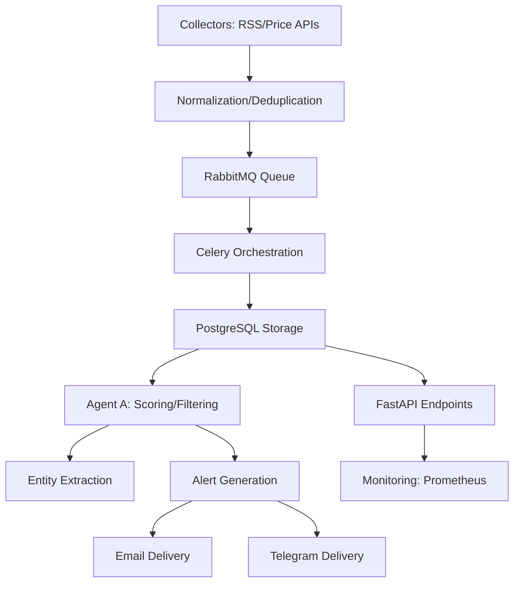

# AETERNA Autonomous Alpha Engine

## Overview

AETERNA is a modular, production-ready data ingestion and event processing engine. It collects, normalizes, deduplicates, queues, stores, and orchestrates events from multiple sources, with robust monitoring and testing.

---

## What Does It Do?

- **Collects data** from RSS feeds, price APIs, and other sources
- **Normalizes** and **deduplicates** events (Redis-based)
- **Queues** events using RabbitMQ (robust, pooled publisher)
- **Stores** events in a database (PostgreSQL via SQLAlchemy)
- **Orchestrates** tasks using Celery (for scheduling and distributed processing)
- **Monitors** health and performance with Prometheus metrics and logging
- **Provides** REST API endpoints for event storage and retrieval
- **Delivers alerts** via email (HTML templates, unsubscribe links) and Telegram (bot integration)
- **Scores and filters events** with Agent A (intelligence module)
- **Extracts crypto entities** from text for analytics and alerting
- **Includes** unit and performance tests for reliability
- **Admin dashboard** for system metrics, user management, and security
- **Role-based access control (RBAC)** for admin endpoints
- **Rate limiting, input sanitization, and security hardening** for admin APIs

---

## Main Components

- **Ingestion:**
   - `app/modules/ingestion/application/rss_collector.py` — Collects and publishes RSS feed events
   - `app/modules/ingestion/application/price_collector.py` — Collects and publishes price events
   - `app/modules/ingestion/application/celery_app.py` — Celery app for orchestration
   - `app/modules/ingestion/application/tasks.py` — Celery tasks for collectors
   - `app/modules/ingestion/infrastructure/models.py` — SQLAlchemy event model
   - `app/modules/ingestion/presentation/api.py` — FastAPI endpoints for event storage
- **Intelligence:**
   - `app/modules/intelligence/application/agent_a.py` — Agent A: event scoring, filtering, bot/spam detection
- **Alerting & Delivery:**
   - `app/modules/delivery/application/telegram_bot.py` — Telegram bot for alert delivery
   - `app/modules/delivery/application/telegram_alert_utils.py` — Backend utilities for Telegram alerts
   - `app/modules/delivery/application/email_utils.py` — Email alerting utilities (Resend API, HTML templates)
   - `app/modules/delivery/application/delivery.py` — Unified alert delivery logic
- **Admin:**
   - `app/modules/admin/presentation/dashboard.py` — Admin dashboard and metrics endpoints
   - `app/modules/admin/presentation/user_management.py` — Admin user management endpoints
   - `app/modules/admin/presentation/admin_protected.py` — Admin-only endpoints
   - `app/modules/admin/middleware.py` — Admin authentication and RBAC
   - `app/modules/admin/presentation/security.py` — Rate limiting and input sanitization
- **Shared Utilities:**
   - `app/shared/utils/email_utils.py` — Secure, templated email sending
   - `app/shared/utils/deduplication.py` — Redis-based deduplication
   - `app/shared/utils/entity_extraction.py` — Crypto entity extraction
   - `app/shared/utils/monitoring.py` — Prometheus metrics and logging
   - `app/shared/utils/rabbitmq_publisher.py` — Robust RabbitMQ publisher
   - `app/shared/utils/auth_utils.py` — Password hashing, JWT creation, verification
- **Testing:**
   - `tests/` — Unit and performance tests

---

## How Does It Work?

1. **Collectors** fetch data from external sources (RSS, price APIs, etc.)
2. **Normalization**: Data is cleaned and standardized
3. **Deduplication**: Redis is used to skip already-seen events
4. **Queueing**: Events are published to RabbitMQ
5. **Orchestration**: Celery schedules and distributes collection tasks
6. **Storage**: Events are saved in a PostgreSQL database
7. **Intelligence:** Agent A scores, filters, and prioritizes events
8. **Alerting:** Alerts are delivered via email and Telegram, with user preferences
9. **Entity Extraction:** Crypto tickers are extracted from event text
10. **API:** FastAPI provides endpoints to create, get, and list events
11. **Monitoring:** Prometheus metrics and logs track system health and throughput
12. **Admin:** Admin dashboard provides system metrics, user management, and security features (RBAC, rate limiting, input sanitization)

---

## How To Run

1. **Install dependencies**: `pip install -r requirements.txt`
2. **Start infrastructure** (RabbitMQ, Redis, PostgreSQL) — use Docker or local installs
3. **Run collectors**:
   - `python -m app.modules.ingestion.application.rss_collector`
   - `python -m app.modules.ingestion.application.price_collector`
4. **Run Celery worker**: `celery -A app.modules.ingestion.application.celery_app worker --loglevel=info`
5. **Run FastAPI app**: `uvicorn app.main:app --reload`
6. **Run Telegram bot**: `python -m app.modules.delivery.application.telegram_bot`
7. **Send alerts**: Use backend utilities for email and Telegram
8. **Run tests**: `pytest tests`
9. **Access Prometheus metrics**: Visit `http://localhost:8001/metrics`

---

## Why Is It Modular?

- Each domain (ingestion, intelligence, alerting, delivery, analytics, etc.) is separated for clarity and scalability
- Easy to add new collectors, event types, agents, or processing logic
- Shared utilities for deduplication, entity extraction, monitoring, and messaging

---

## Who Is This For?

- Anyone needing a scalable, production-grade ingestion and event processing pipeline
- Developers who want clear separation of concerns and robust monitoring

---

## Next Steps

- Add more collectors, agents, or event types as needed
- Integrate with downstream analytics, intelligence, or alerting modules
- Expand alerting preferences and delivery channels
- Deploy to production with Docker/Kubernetes

---

# System Workflow & Architecture

Below is a high-level workflow of how AETERNA processes events and delivers alerts:

1. **Data Collection**
   - RSS feeds and price APIs are polled by collectors (ingestion module).
   - Collected events are normalized and deduplicated (shared utils).
2. **Event Queueing & Orchestration**
   - Deduplicated events are published to RabbitMQ.
   - Celery orchestrates collection and processing tasks.
3. **Event Storage**
   - Events are stored in PostgreSQL via SQLAlchemy models.
4. **Intelligence & Scoring**
   - Agent A (intelligence module) scores, filters, and prioritizes events (noise reduction, bot/spam detection).
5. **Entity Extraction & Analytics**
   - Crypto tickers/entities are extracted for analytics and alerting.
6. **Alerting & Delivery**
   - Alerts are generated based on scored/prioritized events.
   - Alerts are delivered via:
     - **Email**: HTML templates, unsubscribe links, Resend API
     - **Telegram**: Bot integration, user linking (email-based)
7. **API & Monitoring**
   - FastAPI provides REST endpoints for event storage/retrieval.
   - Prometheus metrics and logging monitor system health and throughput.

### Modular Structure

- **Ingestion**: Collects and queues events
- **Intelligence**: Scores and filters events
- **Delivery/Alerting**: Sends alerts via email/Telegram
- **Shared Utils**: Deduplication, entity extraction, monitoring, messaging

### Typical Data Flow

