<p align="center">
  <h1 align="center">⚡ AETERNA — Autonomous Alpha Engine</h1>
  <p align="center">
    <em>AI-powered cryptocurrency intelligence, alerting, and analysis platform with real-time multi-channel delivery.</em>
  </p>
  <p align="center">
    
    
    
    
    
    
  </p>
</p>

---

## 📖 Overview

AETERNA is a **modular, production-ready** data ingestion, intelligence, and event processing engine purpose-built for cryptocurrency markets. It collects data from RSS feeds, price APIs, and on-chain sources, scores and filters events with AI, and delivers real-time alerts via email, Telegram, and WebSocket.

---

## ✨ Key Features

| Category | Capabilities |
|---|---|
| **Data Ingestion** | RSS feeds, price APIs, on-chain blockchain monitoring (Ethereum via WebSocket) |
| **Intelligence** | Agent A — AI-powered event scoring, filtering, noise reduction, bot/spam detection |
| **Alerting** | Real-time alert generation, consumer pipelines, user preference–aware delivery |
| **Delivery** | Email (HTML templates, Resend API), Telegram bot, WebSocket (Socket.IO) push |
| **Identity & Auth** | JWT authentication, user registration/login, user preferences, email preferences |
| **Admin** | Dashboard with system metrics, user management, role management (RBAC), admin bootstrap |
| **Security** | Rate limiting middleware, input sanitization, password hashing, admin-only endpoints |
| **Analytics** | Crypto entity extraction, event analytics domain models |
| **Monitoring** | Prometheus metrics, structured logging, `/health/system` diagnostics |
| **Infrastructure** | PostgreSQL, Redis (dedup + cache), RabbitMQ (event broker), Celery, APScheduler |

---

## 🏗️ Architecture

AETERNA follows a **Domain-Driven Design (DDD)** modular structure. Each module is organized into four layers:

```
app/modules/<module>/
├── application/    # Business logic, services, consumers, collectors
├── domain/         # Domain models, entities, value objects
├── infrastructure/ # Database models, external integrations
└── presentation/   # API routes, schemas, endpoints
```

### Modules

| Module | Purpose | Key Files |
|---|---|---|
| **Ingestion** | Collects events from external sources and publishes to RabbitMQ | `rss_collector.py`, `price_collector.py`, `onchain_collector.py`, `consumer.py` |
| **Intelligence** | AI scoring, filtering, and prioritization of events | `agent_a.py`, `consumer.py` |
| **Alerting** | Generates alerts from scored events and manages alert lifecycle | `alert_generator.py`, `alert_consumer.py`, `alerts.py` |
| **Delivery** | Multi-channel alert delivery (Email, Telegram, Digest) | `delivery.py`, `telegram_bot.py`, `email_utils.py`, `digest_tasks.py` |
| **Identity** | User authentication, registration, and preferences | `services.py`, `auth.py`, `models.py` |
| **Analytics** | Event analytics and crypto entity tracking | `models.py` |
| **Admin** | Dashboard, user/role management, security middleware | `dashboard.py`, `user_management.py`, `role_management.py`, `security.py` |

### Shared Utilities

| Utility | Description |
|---|---|
| `auth_utils.py` | Password hashing, JWT creation & verification |
| `deduplication.py` | Redis-based event deduplication |
| `entity_extraction.py` | Crypto ticker/entity extraction from text |
| `monitoring.py` | Prometheus metrics and structured logging |
| `rabbitmq_publisher.py` | Robust, pooled RabbitMQ publisher |
| `email_utils.py` | Secure, templated email sending |
| `data_extractors.py` | Data extraction and transformation utilities |
| `validators.py` | Input validation helpers |

---

## 🔄 System Workflow

```mermaid
flowchart TD
    A["🌐 Data Sources"] --> A1["RSS Feeds"]
    A --> A2["Price APIs"]
    A --> A3["On-Chain (Ethereum)"]

    A1 --> B["Normalization & Deduplication"]
    A2 --> B
    A3 --> B

    B --> C["📨 RabbitMQ Event Queue"]
    C --> D["Ingestion Consumer"]
    D --> E["💾 PostgreSQL Storage"]
    E --> F["🧠 Intelligence Consumer (Agent A)"]
    F --> G["Alert Generator"]

    G --> H["📧 Email Delivery"]
    G --> I["🤖 Telegram Bot"]
    G --> J["🔌 WebSocket (Socket.IO)"]

    E --> K["📊 FastAPI REST API"]
    K --> L["Prometheus Monitoring"]

    subgraph Scheduling
        S["APScheduler"] --> A1
        S --> A2
        S --> D
        S --> F
    end

    subgraph Worker
        W["onchain_worker.py"] --> A3
    end
```



### Pipeline Flow

1. **Collection** — RSS (60s), Price (120s), and On-Chain (180s) collectors run on scheduled intervals
2. **Normalization** — Raw data is cleaned, standardized, and deduplicated via Redis
3. **Queueing** — Deduplicated events are published to RabbitMQ
4. **Ingestion** — Consumer polls RabbitMQ (5000 msgs/0.5s, up to 20 parallel instances) and persists to PostgreSQL
5. **Intelligence** — Agent A scores, filters, and prioritizes events (50 events/5s cycles)
6. **Alert Generation** — High-priority events trigger alerts based on user preferences
7. **Delivery** — Alerts are pushed via Email, Telegram, and real-time WebSocket
8. **Monitoring** — Prometheus metrics and logs track system health and throughput

---

## 🚀 Quick Start

### Prerequisites

- **Python 3.11+**
- **Docker & Docker Compose** (recommended)
- PostgreSQL 15, Redis 7, RabbitMQ 3.12 (provided via Docker)

### Option 1: Docker (Recommended)

```bash
# Clone the repository
git clone https://github.com/MohidNaghman1/AETERNA-Autonomous-Alpha-Engine.git
cd AETERNA-Autonomous-Alpha-Engine

# Configure environment
cp .env.example .env
# Edit .env with your API keys and credentials

# Start all services
make up

# Run database migrations
make migrate

# Verify services are running
make health
```

All services will be available at:

| Service | URL |
|---|---|
| API | http://localhost:8000 |
| API Docs (Swagger) | http://localhost:8000/docs |
| API Docs (ReDoc) | http://localhost:8000/redoc |
| RabbitMQ Management | http://localhost:15672 |
| Prometheus Metrics | http://localhost:8000/metrics |
| System Health | http://localhost:8000/health/system |

### Option 2: Local Development

```bash
# Install dependencies
pip install -r requirements.txt

# Start infrastructure (RabbitMQ, Redis, PostgreSQL)
docker-compose up -d postgres redis rabbitmq

# Run database migrations
alembic upgrade head

# Start the application
uvicorn app.main:app --reload

# (Optional) Start the on-chain worker in a separate terminal
python onchain_worker.py
```

---

## 🛠️ Development

### Makefile Commands

```bash
make help              # Show all available commands
make dev               # Start dev environment with migrations
make test              # Run tests
make test-coverage     # Run tests with coverage report
make lint              # Lint code with flake8
make format            # Format code with black
make quality           # Run all quality checks (format + lint + typecheck + test)
make migrate           # Run database migrations
make migrate-create MSG="description"  # Create a new migration
make db-shell          # Access PostgreSQL shell
make logs              # View all service logs
make health            # Check service health status
make reset             # Reset everything to fresh start
```

### Dev Startup Scripts

Platform-specific dev startup scripts are available in `scripts/`:

- **Windows**: `scripts/dev_start.ps1`
- **Linux/macOS**: `scripts/dev_start.sh`

### Running Tests

```bash
# Via Docker
make test

# Locally
pytest tests/ -v
```

**Test Coverage:**
- Alert pipeline integration
- Authentication & authorization
- Email preferences & utilities
- Data normalization
- Alembic migrations
- End-to-end integration

---

## ⚙️ Configuration

Copy `.env.example` to `.env` and configure the following:

| Variable | Description |
|---|---|
| `DATABASE_URL` | PostgreSQL connection string |
| `REDIS_URL` / `REDIS_PASSWORD` | Redis connection and password |
| `RABBITMQ_URL` | RabbitMQ AMQP connection string |
| `SECRET_KEY` | JWT signing secret |
| `SMTP_*` | Email SMTP configuration |
| `TELEGRAM_BOT_TOKEN` | Telegram bot token for alert delivery |
| `QUICKNODE_URL` | Ethereum WebSocket endpoint (QuickNode/Alchemy/Infura) |
| `CELERY_BROKER_URL` | Celery broker URL |
| `CORS_ORIGINS` | Allowed CORS origins |

---

## 🐳 Docker Services

The `docker-compose.yml` defines the following services:

| Service | Image | Purpose |
|---|---|---|
| `app` | Custom (Dockerfile) | FastAPI application server |
| `celery_worker` | Custom (Dockerfile) | Celery worker for async tasks |
| `celery_beat` | Custom (Dockerfile) | Celery beat for scheduled tasks |
| `postgres` | postgres:15-alpine | Primary database |
| `redis` | redis:7-alpine | Caching & deduplication |
| `rabbitmq` | rabbitmq:3.12-management-alpine | Message broker |

---

## 📁 Project Structure

```
AETERNA-Autonomous-Alpha-Engine/
├── app/
│   ├── main.py                    # FastAPI app, lifespan, routers, WebSocket
│   ├── settings.py                # App settings
│   ├── config/                    # Database and app configuration
│   ├── modules/
│   │   ├── ingestion/             # Data collection & event ingestion
│   │   ├── intelligence/          # AI scoring & filtering (Agent A)
│   │   ├── alerting/              # Alert generation & consumption
│   │   ├── delivery/              # Multi-channel delivery (Email, Telegram)
│   │   ├── identity/              # Auth, users, preferences
│   │   ├── analytics/             # Event analytics & tracking
│   │   └── admin/                 # Dashboard, user/role mgmt, security
│   └── shared/
│       ├── utils/                 # Shared utilities
│       └── presentation/          # Health endpoints
├── tests/                         # Unit, integration & performance tests
├── docs/                          # Documentation
│   ├── API.md                     # Public API reference
│   └── internal/                  # Private docs (local-only, excluded from GitHub)
├── alembic/                       # Database migrations
├── scripts/                       # Dev startup scripts
├── onchain_worker.py              # Standalone on-chain blockchain worker
├── docker-compose.yml             # Docker service orchestration
├── Dockerfile                     # Container build definition
├── Makefile                       # Development commands
├── requirements.txt               # Python dependencies
├── fly.toml                       # Fly.io deployment config
├── render.yml                     # Render deployment config
└── start.sh                       # Production start script
```

---

## 📚 Documentation

- **[API Reference](docs/API.md)** — Public REST API documentation with endpoints, examples, and client code
- **Interactive Docs** — `/docs` (Swagger UI) and `/redoc` (ReDoc) available on deployed instances

> **Internal docs** (Architecture, PRD, Roadmap, SRS) are maintained in `docs/internal/` and excluded from the public repository via `.gitignore`.

---

## 🚢 Deployment

AETERNA supports multiple deployment targets:

- **Docker Compose** — `docker-compose up -d` for self-hosted deployments
- **Fly.io** — Configuration in `fly.toml`
- **Render** — Configuration in `render.yml`
- **Production Docker** — `make build-prod` for production image

---

## 🤝 Contributing

1. Fork the repository
2. Create a feature branch (`git checkout -b feature/my-feature`)
3. Run quality checks (`make quality`)
4. Commit your changes (`git commit -m "feat: add my feature"`)
5. Push to the branch (`git push origin feature/my-feature`)
6. Open a Pull Request

---

## 📄 License

This project is open source. See the repository for license details.
